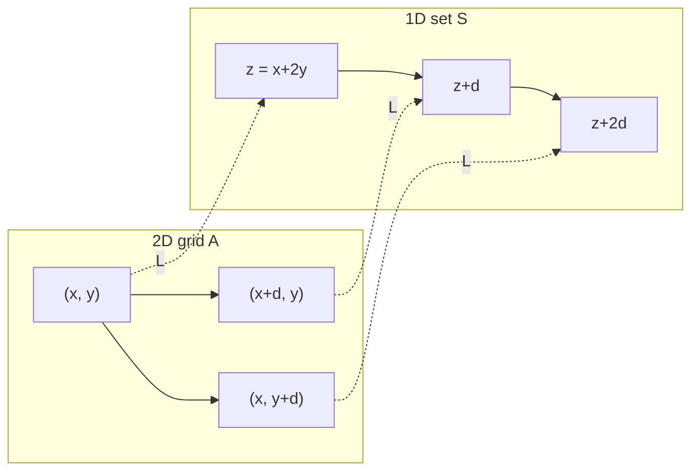

# Corner-Free Set Generator (Behrend Construction)

## Description

**Corner-Free Set Generator** is a small Python **research demo** tied to Behrend-type constructions and the corners problem. It builds a **1D digit-shell** set \(S\) (integers whose base-\(d\) digits lie on a fixed “sphere” \(\sum_i x_i^2 = \mathrm{const}\)), optionally chooses a shell with **no 3-term arithmetic progression**, then forms the paper-style **2D lift** \(A = \{(x,y) \in [n]^2 : x+2y \in S\}\). A corner \((x,y),(x+d,y),(x,y+d)\) in \(A\) would force a 3-AP in \(S\); the script **searches for such corners** so you can contrast the rigorous lift with a **naive digit-split** embedding (which need not stay corner-free). Stdlib-only **SVG figures** illustrate the projection, density intuition, heatmaps, and an NOF sketch for talks.

**Run**

```bash
python behrend_corner_free.py --help
python behrend_corner_free.py --demo
python behrend_corner_free.py --mode paper
python behrend_corner_free.py --mode digit-split
```

**Figures (optional, stdlib-only)** — regenerates every chart in a few seconds:

```bash
python figures/generate_figures.py
```

**Branches / hosting:** Images use relative paths (`figures/…`). On GitHub (or any host), each **branch** shows the `README.md` and `figures/` from **that** branch—commit the SVGs on the branch you present. If a viewer blocks inline SVG, open the files locally or export to PNG from a browser.

### Visual gallery (inline)

| Lift schematic | Density comparison | Heatmap (random vs lift) | NOF sketch |
|:---:|:---:|:---:|:---:|
|  |  |  |  |

*Regenerate before exporting: `python figures/generate_figures.py`.*

---

## 1. Geometry of the lift (projection equivalence)

**Tag:** `lift-diagram`

The paper uses the fact that an **axis corner** in 2D forces a **3-term arithmetic progression** in 1D under the map \(L(x,y)=x+2y\).

If \((x,y), (x+d,y), (x,y+d) \in A\) and \(z=x+2y\), then

\[
z,\quad (x+d)+2y = z+d,\quad x+2(y+d)=z+2d \in S.
\]

So a corner in \(A\) \(\Rightarrow\) a 3-AP in \(S\). The **inverse** direction (start from 3-AP-free \(S\), define \(A\) by \(x+2y\in S\)) is what this repository implements.

**Suggested slide image:** a single figure with (i) a 1D line marked \(z, z+d, z+2d\) and (ii) the corresponding \(L\)-shape \((x,y), (x+d,y), (x,y+d)\) on a grid, with arrows labeled \(L=x+2y\).


**Mermaid (logic flow for handouts / GitHub preview):**



---

## 2. Behrend regime vs stylized bounds

**Tag:** `density-chart`

The manuscript emphasizes moving from very weak **doubly logarithmic** decay toward **quasipolynomial-type** behavior \(\exp(-(\log N)^c)\). Your generator lives in the **Behrend-type** digit-shell world.

**Suggested slide:** a line chart with three traces (qualitative):

| Trace | Role |
|--------|------|
| \(1/\log\log N\) (normalized) | “old-scale” proxy — nearly flat for large \(N\) |
| \(\exp(-(\log N)^{1/2})\) (normalized) | stylized “new-scale” decay |
| **Empirical** \(\|S\|/d^k\) | from `best_S_ap_free_max_count` + `build_behrend_sphere_slice` at \(N=d^k\) |


*Edit `figures/generate_figures.py` to change the \(d,k\) sweep for the red points.*

---

## 3. NOF communication (Project 1)

**Tag:** `nof-sketch`

If your **Project 1** code uses a Number-on-Forehead (NOF) model (players see all inputs except their own), use a **three-player** sketch for the talk track:

- **Alice** sees Bob’s and Charlie’s numbers, not her own.
- **Bob** sees Alice’s and Charlie’s.
- **Charlie** sees Alice’s and Bob’s.

**Suggested slide:** stick figures with integers on foreheads and gaze arrows; caption: “local view = global input minus one coordinate.”


*(This repo is Project 2–centric; wire your Player / Referee classes from Project 1 into the same deck if both are submitted together.)*

---

## 4. Grid norm “clumpiness” (heatmaps)

**Tag:** `heatmap-clumpiness`

**Intuition:** a **uniform random** subset of the same density looks **noise-like** (low structured clumping in a box norm picture); the **paper lift** of a thin shell often shows **anisotropic** structure along lines \(x+2y=\mathrm{const}\).

**Suggested slide:** side-by-side heatmaps of occupancy on \([1,n]^2\):

| Panel | Content |
|--------|---------|
| Left | random Bernoulli mask with \(p \approx \|A\|/n^2\) |
| Right | paper lift \(A=\{(x,y): x+2y\in S\}\) |


---

## Summary table (README ↔ paper story)

| Visual type | Content | Technical link |
|-------------|---------|------------------|
| Diagram | 1D 3-AP \(\{z,z+d,z+2d\}\) vs 2D corner | projection / lift \(x+2y\) |
| Line chart | decay / density vs \(N\) | quasipolynomial-type bounds vs weak bounds |
| Logic map | Alice / Bob / Charlie NOF views | multi-party NOF / “Exactly-\(N\)” viewpoint (Project 1) |
| Heat map | random vs Behrend lift occupancy | “clumpiness” / structured majorants (illustrative) |

---

## File map

| File | Purpose |
|------|---------|
| `behrend_corner_free.py` | Sphere shell, `paper_lift_from_set`, AP-free shell picker, corner checks, CLI |
| `figures/generate_figures.py` | Writes `density_comparison.svg`, `heatmap_lift_vs_random.svg`, `lift_projection.svg`, `nof_sketch.svg` |
| `README.md` | Visual proof-of-concept guide (this file) |

Paper context: [arXiv:2504.07006](https://arxiv.org/abs/2504.07006) (corners, Roth-type links, Behrend-type scale — adjust section citations to match your PDF edition).
