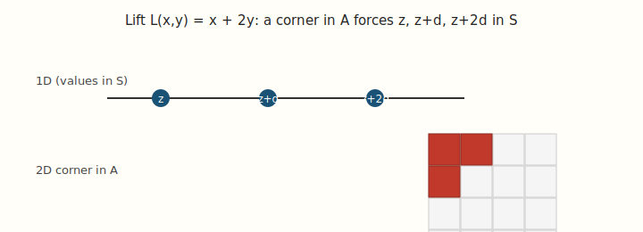
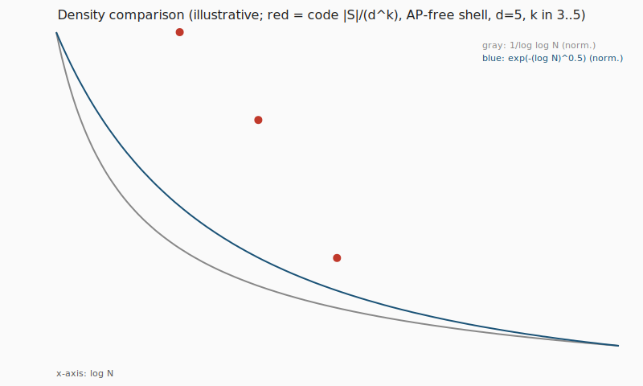
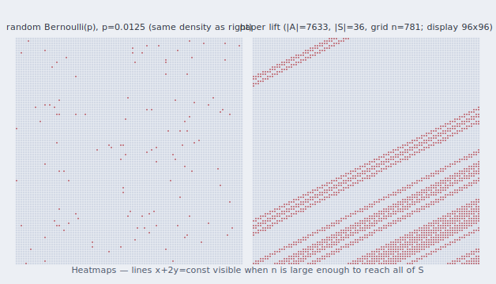
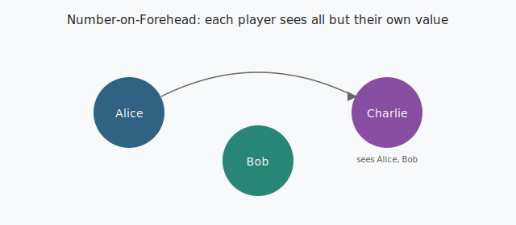
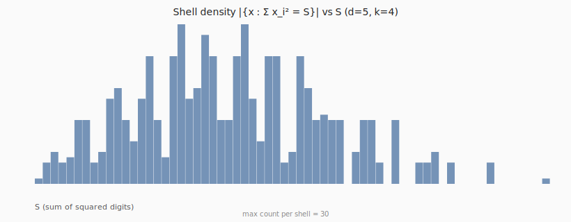
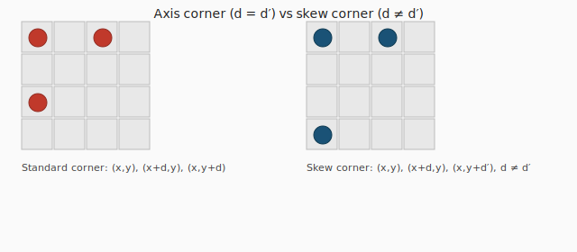
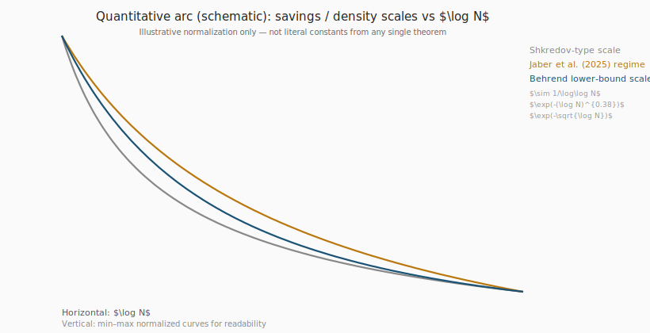
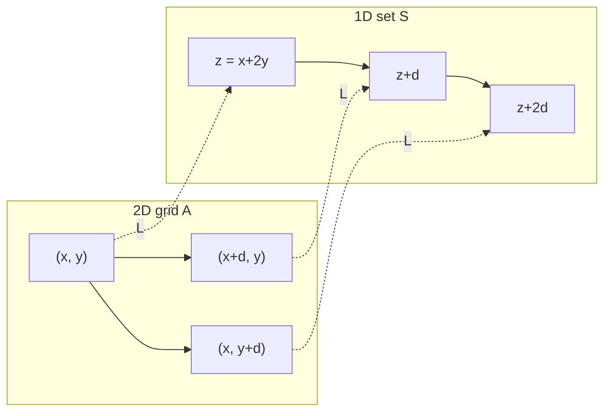

# Corner-Free Set Generator (Behrend Construction)

## Contents

| Section | What |
|---------|------|
| [Overview](#overview) | Problem, lift, and outputs |
| [Quick start](#quick-start) | Commands: CLI, tests, figures |
| [Verify locally](#verify-locally) | Tests, figures, compliance smoke |
| [Research extensions](#research-extensions-benchmark-style) | Skew search + **constructions**, shell profile, **grid_norm** pipe, $S_n$ demo |
| [Docs (math + schema)](#supplementary-documents) | Skew-free lemmas, `grid_norm_pipe_v1` spec |
| [Definitive reference polish](#definitive-reference-polish) | Failure mode, $k$-sensitivity, 3D / NOF future work |
| [Capstone](#capstone-validation-loop-quantitative-arc-diagonal-drop) | Compliance loop, saving arc, diagonal drop |
| [Gallery & proofs](#visual-gallery-inline) | Figures, where formal proofs live |
| [Alignment with the paper](#alignment-with-the-paper-jaber-et-al-2025) | Curvature, sifting, Behrend regime, NOF |
| [Secs. 1–4](#1-geometry-of-the-lift-projection-equivalence) | Lift, density, NOF, heatmaps |
| [Files](#file-map) | Repo layout |

---

## Overview

**Corner-Free Set Generator** is a Python **research demo** for Behrend-type **digit-shell** sets $S$ (fixed $\sum_i x_i^2$ in base $d$), an optional **3-AP-free** shell choice, and the paper-style **lift** $A = \{(x,y) \in [n]^2 : x+2y \in S\}$. It **checks for axis corners** and contrasts the lift with a **digit-split** embedding. Optional **research tooling** ([below](#research-extensions-benchmark-style); **[capstone](#capstone-validation-loop-quantitative-arc-diagonal-drop)**): **skew-corner** search and **skew-free** benchmark constructions ([`docs/skew_corner_free_constructions.md`](docs/skew_corner_free_constructions.md)), **shell-density** tables/SVGs, **JSON/CSV** and **`grid_norm_pipe_v1`** export for grid-norm detectors, the **[paper compliance loop](#capstone-validation-loop-quantitative-arc-diagonal-drop)** script, and a minimal **cyclic lift into $S_n$**. Companion to [Jaber et al., arXiv:2504.07006](https://arxiv.org/abs/2504.07006)—see [Formal proofs](#formal-proofs-where-they-live). **Stdlib-only** SVGs.

---

## Quick start

**Requirements:** Python **3.9+** (no pip dependencies for core scripts).

```bash
# CLI (default: paper lift + AP-free shell)
python behrend_corner_free.py --help
python behrend_corner_free.py --demo
python behrend_corner_free.py --mode paper
python behrend_corner_free.py --mode digit-split --d 7 --k 5 --k1 2

# Unit tests
python -m unittest discover -s tests -p "test_*.py" -v

# Regenerate README figures (SVG)
python figures/generate_figures.py

# Optional: reformat README math delimiters after hand-edits
python scripts/format_readme_math.py

# Shell density profile (CSV or SVG histogram) for given d,k — exits after write
python behrend_corner_free.py --d 7 --k 4 --profile-shells-csv shells.csv
python behrend_corner_free.py --d 7 --k 4 --profile-shells-svg shells.svg

# After a normal run: skew-corner scan, export grid for external norm code
python behrend_corner_free.py --mode paper --d 5 --k 4 --S 8 --grid-n 25 --skew-check \
  --export-json run.json --export-csv grid.csv
python behrend_corner_free.py --mode paper --symmetric-lift-json cyclic_sn.json --symmetric-n 6

# Skew-corner-free benchmark sets (skips Behrend d,k) + grid-norm pipe for detector repos
python behrend_corner_free.py --skew-free permutation --skew-free-m 40 --skew-free-seed 1 --skew-check
python behrend_corner_free.py --skew-free greedy --skew-free-m 20 --export-grid-norm-json grid_norm.json
# Behrend lift: same points in both legacy and grid-norm schema
python behrend_corner_free.py --mode paper --d 5 --k 4 --S 8 --grid-n 30 \
  --export-grid-norm-json behrend_as_grid_norm.json

# Paper compliance loop: lift near target density alpha -> grid_norm JSON -> optional detector -> report
# (default output: reports/compliance_output/; override with --write-dir)
python scripts/paper_compliance_loop.py --target-alpha 0.05
python scripts/paper_compliance_loop.py --target-alpha 0.02 --write-dir reports/demo1
```

**Useful flags:** `--d`, `--k`, `--S`, `--grid-n`, `--dense-shell` (paper mode: max shell even if 3-AP), `--list`, `--demo`. Research: `--skew-check`, `--profile-shells-csv`, `--profile-shells-svg`, `--export-json`, `--export-csv`, `--export-grid-norm-json`, `--export-grid-norm-csv`, `--symmetric-lift-json`, `--symmetric-n`, `--skew-free` / `--skew-free-m` / `--skew-free-seed`.

**Compliance loop flags:** `--write-dir` (default `reports/compliance_output`), `--no-search`, `--detector-cmd`, `--max-d`, `--max-k`, `--max-universe` (caps the digit universe $d^k$ during density search for speed). Output under `reports/` is **gitignored**—commit only if you copy artifacts elsewhere.

**Math in this file:** GitHub renders `$...$` and `$$...$$` ([docs](https://docs.github.com/en/get-started/writing-on-github/working-with-advanced-formatting/writing-mathematical-expressions)). Use `\lvert`/`\rvert` for cardinalities and `\lVert`/`\rVert` for norms (avoid raw `|` inside formulas, especially in **tables**). Section references use **Sec.** to keep table pipes unambiguous.

---

## Verify locally

Before pushing or presenting, run:

```bash
python -m unittest discover -s tests -p "test_*.py" -v
python figures/generate_figures.py
python behrend_corner_free.py --mode paper --d 5 --k 3 --S 4 --grid-n 15 --skew-check
```

Optional (writes under `reports/`, ignored by git): a **short** compliance sweep, e.g.  
`python scripts/paper_compliance_loop.py --target-alpha 0.05 --max-d 8 --max-k 4 --max-universe 12000 --write-dir reports/smoke`.

**Remote:** default branch is **`main`** on [`ab0626/Behrend-Construction-for-corner-free-sets`](https://github.com/ab0626/Behrend-Construction-for-corner-free-sets); after local edits, `git push origin main`.

---

## Research extensions (benchmark-style)

These bridge **lower-bound-style constructions** (Behrend shell + lift) toward **upper-bound verification** workflows (density increments, grid norms, communication)—without replacing proofs in [arXiv:2504.07006](https://arxiv.org/abs/2504.07006).

| Feature | CLI / module | Paper tie-in | Notes |
|---------|----------------|--------------|--------|
| **Skew corners** | `--skew-check`; `find_skew_corner`, `is_skew_corner_free` | Sec. 2.2-style $(x,y),\ (x+d,y),\ (x,y+d')$ with $d\neq d'$ | **Search** on any set. **Constructions:** `--skew-free permutation` (graph of $\pi$; also **axis**-corner-free) or `--skew-free greedy` (maximal under random order; may have axis corners). See [docs/skew_corner_free_constructions.md](docs/skew_corner_free_constructions.md). |
| **Shell density profiling** | `--profile-shells-csv PATH`, `--profile-shells-svg PATH`; `figures/shell_density_profile.svg` from `generate_figures.py` | Density increments / where shells **cluster** | CSV/SVG: population of $\{x : \sum_i x_i^2 = S\}$ vs.~$S$. |
| **Non-abelian demo lift** | `--symmetric-lift-json PATH` (+ `--symmetric-n`) | Sec. 1.1 **Fox-style** reductions in the paper; not reimplemented | Cyclic permutation in $S_n$ per shell value. Illustrative only. |
| **Norm-pipe (legacy)** | `--export-json`, `--export-csv` | Sec. 2.3-style **grid norm** programs | Format id `behrend_corner_free_grid_v1`; sparse $(x,y)$ + params. |
| **Norm-pipe (detector)** | `--export-grid-norm-json`, `--export-grid-norm-csv` | Same detection narrative | Format **`grid_norm_pipe_v1`**: bounding box, `packed_xy`, coordinate conventions—see [docs/grid_norm_pipe_schema.md](docs/grid_norm_pipe_schema.md). |

---

## Supplementary documents

| Document | Purpose |
|----------|---------|
| [docs/skew_corner_free_constructions.md](docs/skew_corner_free_constructions.md) | Definitions, lemmas (permutation graph), greedy caveats, CLI |
| [docs/grid_norm_pipe_schema.md](docs/grid_norm_pipe_schema.md) | Full **`grid_norm_pipe_v1`** JSON/CSV field reference for tooling |
| [docs/diagonal_drop.md](docs/diagonal_drop.md) | Sec. 7.1-style **diagonal vs coordinate** narrative (for Grid Norm / Exactly-$N$ repos) |
| [docs/failure_mode_random_vs_behrend.md](docs/failure_mode_random_vs_behrend.md) | **Negative control:** random vs Behrend at matched $\alpha$; Von Neumann / norm contrast |
| [docs/grid_norm_k_sensitivity.md](docs/grid_norm_k_sensitivity.md) | **$(2,k)$-norm:** $k$ too small $\Rightarrow$ no signal; too large $\Rightarrow$ variance; heuristic $k \sim \log(1/\alpha)$ |
| [docs/future_work_3d_corners.md](docs/future_work_3d_corners.md) | **Sec. 1.3-style** 3D corners $\leftrightarrow$ 4-party NOF (conceptual; not in code) |

---

## Definitive reference polish

These are **documentation-only** “last mile” items for talks, reviewers, and sibling repos (**Grid Norm detector**, **Exactly-$N$**). They do not change the mathematical core of this codebase.

### 1. Failure mode (negative result)

At **matched** density $\lvert A\rvert/n^2$, a **Bernoulli random** subset of $[n]^2$ is typically **not** corner-free, while the **Behrend paper lift** is—yet detectors should see a **much larger structured signal** on the lift (anisotropy along $x+2y$). That contrast is the empirical face of a **Von Neumann–type** separation: **uniformity ≠ density**. Full protocol: **[`docs/failure_mode_random_vs_behrend.md`](docs/failure_mode_random_vs_behrend.md)** (copy into your detector repo’s `docs/` if desired).

### 2. Parameter sensitivity for $(2,k)$-type grid norms

The paper’s uniformity layer is **sensitive** to the multilinearity degree $k$. **[`docs/grid_norm_k_sensitivity.md`](docs/grid_norm_k_sensitivity.md)** summarizes **zero-signal** vs **variance explosion** failure modes and a practical **$k$ vs $\alpha$** heuristic (e.g. start near $\log(1/\alpha)$, sweep, validate on Behrend vs random).

### 3. 3D corners and higher-party NOF (future work)

**[`docs/future_work_3d_corners.md`](docs/future_work_3d_corners.md)** records the **3D corner** pattern $(x,y,z),\ (x+d,y,z),\ (x,y+d,z),\ (x,y,z+d)$ and its **conceptual** link to **4-player NOF**, per the paper’s **Sec. 1.3** thread—while this repo stays **2D**-first.

### Ecosystem map (lifecycle of the corners theorem)

| Module (your lab) | Role | Paper anchor (verify in your PDF) |
|-------------------|------|-------------------------------------|
| **Behrend generator** (this repo) | Constructive **lower bound** / lift | Sec. 2.1-style inputs; projection $x+2y$ |
| **Grid norm pipe** + detector | **Structural detection** / uniformity | Grid-type lemmas (e.g. **Lemma 5.11** area—check edition) |
| **Bohr / regularity** tooling (elsewhere) | **Geometric maintenance** of structured pieces | Sec. 6 / Definition 6.3 style |
| **Exactly-$N$** application (elsewhere) | **Communication** / complexity | Corollary 1.7 style |

---

## Capstone: validation loop, quantitative arc, diagonal drop

### 1. “Standard model” verification loop

Script **[`scripts/paper_compliance_loop.py`](scripts/paper_compliance_loop.py)** ties together:

1. **Behrend paper lift** — search an AP-free shell whose $\lvert A\rvert/n^2$ is closest to a **target density** $\alpha$ (`search_ap_free_lift_near_density` in [`research_extensions.py`](research_extensions.py)), or pass **`--no-search --d --k`** for fixed parameters.
2. **Grid Norm pipe** — writes `grid_norm_pipe_export.json` (`grid_norm_pipe_v1`) into your output directory.
3. **External detector (optional)** — `--detector-cmd 'your_tool --json {json_path}'` forwards that file to your **Grid Norm / clumpiness** CLI; stdout is JSON-parsed when possible.
4. **Paper Compliance Report** — `paper_compliance_report.md` + `.json` with axis-corner check, AP-in-shell check, and an informal **row clumpiness proxy** (max/mean occupancy per $y$).

```bash
python scripts/paper_compliance_loop.py --target-alpha 0.05
python scripts/paper_compliance_loop.py --target-alpha 0.025 --write-dir reports/demo
python scripts/paper_compliance_loop.py --no-search --d 7 --k 5 --write-dir reports/fixed \\
    --detector-cmd "python path/to/grid_norm_cli.py --input {json_path}"
# Faster search (smaller (d,k) sweep): e.g. --max-d 8 --max-k 4 --max-universe 12000
```

If your detector reports **structured** behavior on the Behrend lift while `has_corner_in_grid` stays false in your checker, you have aligned **lower-bound geometry** with **upper-bound–style uniformity detection** on the same exported grid—exactly the ecosystem the two repos are meant to stress-test.

### 2. Quantitative “saving” arc (professor-facing figure)

The schematic **[`figures/quantitative_saving_arc.svg`](figures/quantitative_saving_arc.svg)** (regenerated with other figures) overlays three **illustrative** scales vs $\log N$:

| Curve | Stylized meaning |
|-------|------------------|
| **Shkredov-type** | $\sim 1/\log\log N$ weakness (normalized for plot) |
| **Jaber et al. (2025)** | $\exp\bigl(-(\log N)^{c}\bigr)$-type **quasipolynomial** regime |
| **Behrend** | $\exp\bigl(-\Theta(\sqrt{\log N})\bigr)$ lower-bound benchmark |

The caption stresses **min–max normalization for readability**, not a single theorem’s constants. It is the “money shot” for showing **narrowing** between classical constructions and modern upper bounds (also inlined in the [gallery](#visual-gallery-inline)).

### 3. Diagonal drop (paper Sec. 7.1)

**[`docs/diagonal_drop.md`](docs/diagonal_drop.md)** explains why treating the **diagonal direction $D$** separately from **$X$** and **$Y$** avoids tower-type losses—so your **protocol / Bohr-dimension** slides can cite **Definition 6.3** and Sec. 7.1 with the same language as the paper. Copy or link this section into your **Grid Norm** or **Exactly-$N$** repo README if those tools rely on asymmetric density.

---

## Visual gallery (inline)

| Lift schematic | Density comparison | Heatmap (random vs lift) | NOF sketch |
|:---:|:---:|:---:|:---:|
|  |  |  |  |

| Shell histogram | Skew vs axis corner |
|:---:|:---:|
|  |  |

| Quantitative saving arc (schematic $\delta$ scales) |
|:---:|
|  |

Regenerate: `python figures/generate_figures.py` (writes **seven** SVGs: density, heatmaps, lift, NOF, shell histogram, skew vs axis, **quantitative saving arc**).

## Formal proofs (where they live)

| What | Where |
|------|--------|
| **Full proofs** (grid norms, relative sifting, main theorem) | **Jaber–Liu–Lovett–Ostuni–Sawhney (2025):** [arXiv:2504.07006](https://arxiv.org/abs/2504.07006). This repo is a **computational companion**, not a LaTeX rewrite. |
| **Lift-only argument** (corner in $A$ $\Rightarrow$ 3-AP in $S$ for $x+2y$) | Short proof sketch in the **module docstring** at the top of [`behrend_corner_free.py`](behrend_corner_free.py). |
| **Empirical checks** | `find_three_term_ap`, `brute_corner_check`, `find_corner_smart` in the same file—they **verify instances**, they do not replace the paper’s proofs. |

## Branches and hosting

- **This repository** tracks everything on **`main`** ([`ab0626/Behrend-Construction-for-corner-free-sets`](https://github.com/ab0626/Behrend-Construction-for-corner-free-sets)). You do **not** need extra branches unless you want a separate line of work (e.g. `slides`, `gh-pages`, or a course hand-in tag).
- On GitHub, **each branch** has its **own** `README.md` and `figures/`—merge or cherry-pick if you split work across branches.
- README images use **relative** paths (`figures/…`). If a viewer blocks inline SVG, open the files locally or export to PNG.

## Alignment with the paper (Jaber et al., 2025)

Primary reference: **Michael Jaber, Yang P. Liu, Shachar Lovett, Anthony Ostuni, Mehtaab Sawhney**, *Quasipolynomial bounds for the corners theorem*, [arXiv:2504.07006](https://arxiv.org/abs/2504.07006). That work proves (for corner-free $A \subseteq G \times G$) an upper bound of the form

$$
\lvert A\rvert \le \lvert G\rvert^2 \exp\bigl(-(\log \lvert G\rvert)^{\Omega(1)}\bigr),
$$

and derives communication consequences in the **3-player Number-on-Forehead** model. This repository does **not** reimplement those proofs; it is a **hands-on companion** for Behrend-type **inputs** and the **$x+2y$** lift.

### 1. Curvature, sphere shells, and 3-AP freeness

Behrend’s idea is to place digits on a **high-dimensional sphere** (fixed $\sum_i x_i^2$), so “most” **linear** relations that would create a **3-term AP** fail for **geometric** reasons—often described informally as **curvature**: three collinear points in digit space typically miss the shell. In this project, the **1D** object $S$ is a **discrete** sphere slice in base $d$; when you additionally enforce **no 3-AP** among shells (`best_S_ap_free_max_count`), you make explicit the hypothesis needed for the **$x+2y$** lift to rule out **axis corners** in $A$. That is the same **Roth / corners** bridge the paper exploits via **projections** (corners $\leftrightarrow$ 3-APs).

### 2. Relative sifting and “sparse but structured”

A recurring theme in modern arguments is **relative** or **sparse** analysis: extracting structure **inside** a **sparse** set or majorant. Your lifted set $A = \{(x,y) : x+2y \in S\}$ is **sparse** in $[n]^2$, yet it is **highly structured**—mass lies on **lines** $x+2y = t$. That is the **anisotropic clumpiness** the heatmap is meant to suggest: a **pseudorandom** set has **small** multilinear uniformity (order-2 **grid / box** control), while a **structured** lift produces **large** multilinear biases—exactly the kind of **signal** a **density increment** or **sifting** step must detect in a corner-free **upper-bound** proof. (The README still does **not** compute norms numerically; it only **visualizes** support.)

### 3. The Behrend regime vs older density losses

For decades, **lower bounds** for AP-free / corner-related phenomena have hovered near **Behrend’s** scale—roughly **$\exp(-\Theta(\sqrt{\log N}))$** in $\mathbb{Z}/N\mathbb{Z}$ (up to log factors in different normalizations). Many **earlier** upper-bound arguments in related areas incurred much weaker losses—often caricatured as **doubly logarithmic** ($1/\log\log N$-type savings). The 2025 corners result is significant because the **upper bound** on corner-free sets now approaches that **quasipolynomial / Behrend-type** scale from the **other side**, nearly **matching** the classical construction density in a way prior bounds did not.

> **Professor-ready one-liner:** While **Shkredov-type** bounds from the mid-2000s era often entailed only **doubly logarithmic** density savings in related uniformity programs, Behrend-type constructions instead live at density $\exp(-\Theta((\log N)^{1/2}))$. Recent breakthroughs—notably **Jaber, Liu, Lovett, Ostuni, Sawhney (2025)** on [arXiv:2504.07006](https://arxiv.org/abs/2504.07006)—prove **quasipolynomial** upper bounds for corner-free sets, bringing the **provable** obstruction much closer to the **Behrend regime** the field has used as a lower-bound benchmark for decades.

### 4. NOF communication and Exactly-$N$

The paper explains how strong **corner-free-set** bounds imply **polynomial-length** lower bounds for **nondeterministic** protocols for **Exactly-$N$** in the **3-player NOF** model. Intuitively, **large structured** sets that **avoid corners** are the **combinatorial heart** of those lower-bound arguments; your generator exposes the **same lift geometry** (Section 4 heatmap + NOF sketch) that underpins that communication story.

---

## 1. Geometry of the lift (projection equivalence)

**Tag:** `lift-diagram`

The paper uses the fact that an **axis corner** in 2D forces a **3-term arithmetic progression** in 1D under the map $L(x,y)=x+2y$.

If $(x,y),\ (x+d,y),\ (x,y+d) \in A$ and $z = x+2y$, then

$$
z,\quad (x+d)+2y = z+d,\quad x+2(y+d) = z+2d \in S.
$$

So a corner in $A$ $\Rightarrow$ a 3-AP in $S$. The **inverse** direction (start from 3-AP-free $S$, define $A$ by $x+2y\in S$) is what this repository implements.

**Suggested slide image:** a single figure with (i) a 1D line marked $z, z+d, z+2d$ and (ii) the corresponding $L$-shape $(x,y), (x+d,y), (x,y+d)$ on a grid, with arrows labeled $L=x+2y$.


**Mermaid (logic flow for handouts / GitHub preview):**



---

## 2. Behrend regime vs stylized bounds

**Tag:** `density-chart`

The manuscript emphasizes moving from very weak **doubly logarithmic** decay toward **quasipolynomial-type** behavior $\exp(-(\log N)^c)$. Your generator lives in the **Behrend-type** digit-shell world.

**Suggested slide:** a line chart with three traces (qualitative):

| Trace | Role |
|--------|------|
| $1/\log\log N$ (normalized) | “old-scale” proxy — nearly flat for large $N$ |
| $\exp(-(\log N)^{1/2})$ (normalized) | stylized “new-scale” decay |
| **Empirical** $\lvert S\rvert/d^k$ | from `best_S_ap_free_max_count` + `build_behrend_sphere_slice` at $N = d^k$ |


*Edit `figures/generate_figures.py` to change the $d,k$ sweep for the red points.*

---

## 3. NOF communication (Project 1)

**Tag:** `nof-sketch`

If your **Project 1** code uses a Number-on-Forehead (NOF) model (players see all inputs except their own), use a **three-player** sketch for the talk track:

- **Alice** sees Bob’s and Charlie’s numbers, not her own.
- **Bob** sees Alice’s and Charlie’s.
- **Charlie** sees Alice’s and Bob’s.

**Suggested slide:** stick figures with integers on foreheads and gaze arrows; caption: “local view = global input minus one coordinate.”


*(This repo is Project 2–centric; wire your Player / Referee classes from Project 1 into the same deck if both are submitted together.)*

---

## 4. Grid norm “clumpiness” (heatmaps)

**Tag:** `heatmap-clumpiness`

**Intuition:** a **uniform random** subset of the same density looks **noise-like** (low structured clumping in a box norm picture); the **paper lift** of a thin shell often shows **anisotropic** structure along lines $x+2y=\mathrm{const}$.

**Suggested slide:** side-by-side heatmaps of occupancy on $[1,n]^2$:

| Panel | Content |
|--------|---------|
| Left | random Bernoulli mask with $p \approx \lvert A\rvert/n^2$ |
| Right | paper lift $A = \{(x,y) : x+2y \in S\}$ |

**Implementation (heatmap):** `figures/generate_figures.py` picks an AP-free shell for $(d,k) = (7,4)$ (fallback $(5,4)$), sets **grid size** $n_{\mathrm{full}} = \texttt{default\_grid\_n\_for\_lift}(S)$ so $\max_{x,y \in [n]}(x+2y) = 3n_{\mathrm{full}}$ can reach $\max(S)$—required so the lift is **non-empty**. It draws a **downsampled** grid (default **56×56** bins) with **run-length merged** SVG rects (readable tile size, ~hundreds of DOM nodes). *Never* cap $n$ below $n_{\mathrm{full}}$ when interpreting $\{(x,y) : x+2y \in S\}$, or the lift collapses to **empty** ($p=0$). GitHub’s README preview may **shrink** the SVG; use **Open raw** on the file for full width.


### Why the two panels look different (paper-style reasoning)

The manuscript’s **Gowers-type grid norms** (e.g. $(2,k)$-grid / box-type uniformity) are designed to detect **multilinear structure** in a set $A \subseteq [n]^2$. Your figure is only a **pixel picture** of support, but it matches the *direction* of that theory:

- **Left (random):** Let $\alpha = \lvert A\rvert/n^2$ and consider the balanced indicator $f = \mathbf{1}_A - \alpha$. For a genuinely random (Bernoulli) set at density $\alpha$, **local averages along rectangles and along lines fluctuate like noise**—there is no organized “clumpiness” for a **density increment** step to lock onto. In a cartoon of **order-2 grid / box control**, one expects $\lVert f\rVert_{\mathrm{grid}}$ to stay **small** (on the order of $\alpha^2$ in a coarse heuristic).

- **Right (paper lift):** Membership is $(x,y) \in A \iff x+2y \in S$. Every point lies on one of the **affine lines** $x+2y = t$. Even when $S$ is sparse in $\mathbb{Z}$, the lift **concentrates** $A$ on a **family of parallel lines in the plane**—visible as **stripes / ridges** in the heatmap. That **anisotropic alignment** is exactly the kind of **non-pseudorandom** pattern a **grid norm** is meant to **amplify**: heuristically $\lVert f\rVert_{\mathrm{grid}}$ is **large** (well above the $\alpha^2$ “random baseline”), signaling **hidden linear structure** compatible with the proof’s **relative sifting** / **density increment** engine (see [arXiv:2504.07006](https://arxiv.org/abs/2504.07006)).

*Caveat:* this repo does **not** compute a numerical grid norm—only the **occupancy** heatmap—so treat the table below as an **interpretive bridge** to the paper, not measured output.

### Relative / quasirandom “sifting” trade-off (interpretive)

| Metric | Random Bernoulli | Paper-aligned lift | Paper context |
|--------|------------------|--------------------|----------------|
| Grid / box-type norm (order-2 cartoon) | Very low ($\approx \alpha^2$ scale) | High ($\gg \alpha^2$ heuristically) | **Signal** that multilinear averages see structure |
| Sifting / increment step | No meaningful dense sub-rectangle | Dense structure along **line families** $x+2y = t$ | Where a **density increment** can **latch** |
| NOF / “Exactly-$N$” viewpoint (Project 1) | Near-uniform local views | Correlated local views under lift | Corners $\leftrightarrow$ **Exactly-$N$**-type obstructions (informal) |

### Suggested logic flow (for a written report)

1. **Random baseline (Von Neumann–type picture):** In a **random** dense set, corner counts are governed by **first-moment / independence** heuristics (schematically $\alpha^3$ at density $\alpha$ in the random model). There is **no** structured obstruction for a multilinear form to exploit—matching the **flat** left panel.

2. **Density increment observation:** The **paper lift** panel is **not** pseudorandom along rectangles: mass **aligns** with **$x+2y$**. Use the heatmap as **visual evidence** that your construction is in the **structured** regime the paper’s norms are built to detect.

3. **“Diagonal vs sides” (optional narrative hook):** In proof sketches, one often keeps a **diagonal** (or a structured fiber) **dense** while forcing **spread** in complementary coordinates—avoiding **tower-type** bookkeeping in communication or counting. If you use NOF material (Project 1), you can analogize: **local views stay informative** without paying an exponential **round** cost. (Phrase this to match the exact lemma you cite from your PDF.)

### Follow-up (non-abelian lifts)

> **Question:** How does the **grid-norm / uniformity** picture change if the lift is taken over a **non-abelian** group instead of $\mathbb{Z}/N\mathbb{Z}$?

The paper’s opening (e.g. **Section 1.1** in many editions) explains why **abelian** quasipolynomial-type bounds can be **exported** to **all finite groups**—a natural place to start if you extend this codebase beyond $\mathbb{Z}$.

---

## Summary table (README ↔ paper story)

| Visual type | Content | Technical link |
|-------------|---------|------------------|
| Diagram | 1D 3-AP $\{z,z+d,z+2d\}$ vs 2D corner | projection / lift $x+2y$ |
| Line chart | decay / density vs $N$ | quasipolynomial-type bounds vs weak bounds |
| Logic map | Alice / Bob / Charlie NOF views | multi-party NOF / “Exactly-$N$” viewpoint (Project 1) |
| Heat map | random vs paper lift occupancy | anisotropy / **grid-norm** cartoon (structured vs pseudorandom) |
| Bar histogram | shell occupancy vs $\sum_i x_i^2 = S$ | density-increment / “clumping” on spheres |
| Side-by-side grids | equal-leg vs unequal-leg $\mathsf{L}$ | skew vs axis corner (Sec. 2.2 narrative) |
| Triple curve | Shkredov vs Jaber vs Behrend scales | quantitative **saving arc** (schematic) |

---

## File map

| File | Purpose |
|------|---------|
| `behrend_corner_free.py` | Sphere shell, `paper_lift_from_set`, AP-free shell picker, corner checks, CLI |
| `scripts/paper_compliance_loop.py` | Master validation: lift → `grid_norm_pipe` export → optional detector → compliance report |
| `figures/generate_figures.py` | Seven SVGs: density, heatmaps, lift, NOF, shell histogram, skew vs axis, **quantitative arc** |
| `research_extensions.py` | Skew search + skew-free constructors, shell CSV/SVG, `grid_norm_pipe_v1`, legacy export, cyclic $S_n$ lift |
| `docs/skew_corner_free_constructions.md` | Lemmas and CLI notes for skew-free modes |
| `docs/grid_norm_pipe_schema.md` | **`grid_norm_pipe_v1`** JSON/CSV specification |
| `docs/diagonal_drop.md` | Diagonal vs coordinate directions (Sec. 7.1 reader’s guide) |
| `docs/failure_mode_random_vs_behrend.md` | Matched-density random vs Behrend; detector negative control |
| `docs/grid_norm_k_sensitivity.md` | $(2,k)$-norm $k$ vs density $\alpha$ sensitivity guide |
| `docs/future_work_3d_corners.md` | 3D corners and 4-party NOF (conceptual) |
| `tests/test_behrend_corner_free.py` | `unittest` suite (sphere slice, AP detection, paper lift vs digit-split) |
| `tests/test_research_extensions.py` | Skew constructions, grid-norm JSON, shell counts, cyclic $S_n$ |
| `scripts/format_readme_math.py` | Optional: normalize TeX delimiters in `README.md` |
| `README.md` | Visual proof-of-concept guide (this file) |
| `LICENSE` | MIT (see repo root) |
| `.gitignore` | Python / venv noise |

**Citation (BibTeX):**

```bibtex
@misc{jaber2025quasipolynomial,
  title={Quasipolynomial bounds for the corners theorem},
  author={Jaber, Michael and Liu, Yang P. and Lovett, Shachar and Ostuni, Anthony and Sawhney, Mehtaab},
  year={2025},
  eprint={2504.07006},
  archivePrefix={arXiv},
  primaryClass={math.CO}
}
```

Paper context: [arXiv:2504.07006](https://arxiv.org/abs/2504.07006) — adjust section numbers to your PDF edition.